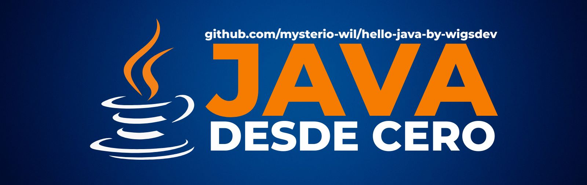

# Hello Java by [wigsdev](https://github.com/mysterio-wil)

## Curso para aprender el lenguaje de programación Java desde cero y para principiantes

> ##### Si consideras útil el curso, apóyalo haciendo "★ Star" en el repositorio. ¡Gracias!

## Enlaces de interés

*Próximamente...*

##  Hola, mi nombre es Wilmer Gulcochía.
### 🚀 Data Analyst y Fullstack Developer

Soy bachiller en Ciencias Agrarias con una gran pasión por la tecnología. Cuento con una certificación oficial en Fundamentos de Analítica de Datos por Guayerd en colaboración con IBM SkillsBuild. Completé la especialización de Desarrollador Frontend en Alura Latam como parte del programa Oracle Next Education. Actualmente estudio en el Bootcamp Fullstack JavaScript con Guillermo Rodaz y me preparo para obtener la certificación Full Stack Developer de FreeCodeCamp. Además, tengo experiencia en diseño gráfico, desarrollo web y elaboración de mapas y planos.

### 🌐 Socials

### 🌟 Créditos

* [Curso Java desde Cero](https://github.com/mouredev/hello-java) by [mouredev](https://github.com/mouredev)